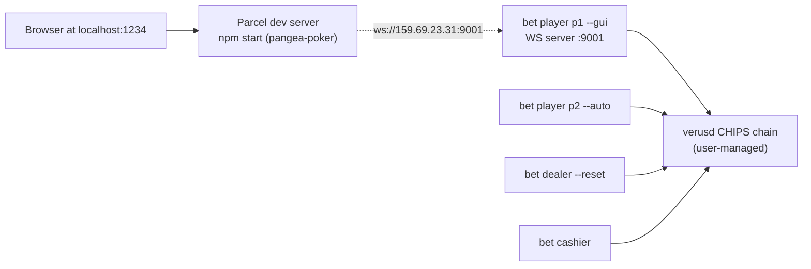

# GUI End-to-End Test Plan

## Topology



- p1 plays via the GUI; p2 auto-plays.
- p1 joins **first** (GUI flow: empty table -> Find Table -> pick seat -> live updates as p2 arrives).
- IP stays at the existing default `159.69.23.31` (this machine's public IP).
- Backend WS server listens on all interfaces (lws default), so loopback through the public IP works fine.

---

## Phase 0 - Pre-flight (read-only)

- Confirm chain is up: `verus -chain=chips getblockcount` (no node start, just check).
- Confirm wallet balance >= roughly `0.5 + 0.5 + 0.05` CHIPS (two payins + tx fees + reserves) on dealer/cashier wallets.
- Confirm `/root/pangea-poker/node_modules/` exists; if not, `npm install` (one time, with approval).
- Confirm port 1234, 9001, 9002 are free: `ss -ltn | grep -E '1234|900[12]'`.
- Confirm the binary at `/root/bet/poker/bin/bet` is the current `gui_dev` build (mtime newer than the merge-mode CMM commit).

Pass criteria: chain block count > 0, balances OK, ports free, binary current.

---

## Phase 1 - Bring up backend (dealer + cashier)

In their existing tmux sessions:

1. Stop any stale `./bin/bet` processes (Ctrl-C in `dealer`, `cashier`, `p1`, `p2` sessions).
2. Start dealer: `cd /root/bet/poker && ./bin/bet start dealer -c config/dealer.ini --reset`
3. Wait until log shows `Table reset complete. Waiting for players to join...`.
4. Start cashier: `cd /root/bet/poker && ./bin/bet start cashier -c config/cashier.ini`
5. Wait until log shows `Table is started`.

Pass criteria: `verus -chain=chips getidentity t1.sg777z.chips.vrsc@` shows the 3 fresh keys (T_GAME_ID, T_TABLE_INFO.<g>, T_GAME_INFO.<g>); cashier is alive.

Reference: `dealer_reset_table` at [poker/src/dealer.c](poker/src/dealer.c) lines 568-640.

---

## Phase 2 - Start the GUI dev server

User runs:

```bash
cd /root/pangea-poker
npm start
```

This is Parcel 1 (`parcel src/index.html --open --out-dir build`) per [pangea-poker/package.json](pangea-poker/package.json) line 19. Default URL `http://localhost:1234`. `--open` will try to open the system browser; if running over SSH, the user opens it manually in their local browser pointed at the dev box.

Pass criteria: Parcel reports `Server running at http://localhost:1234`, no compile errors.

---

## Phase 3 - Start p1 in GUI mode

In the `p1` tmux session:

```bash
cd /root/bet/poker && ./bin/bet start player -c config/p1.ini --gui
```

This brings up the LWS server at port 9001 ([poker/src/client.c](poker/src/client.c) `bet_player_frontend_loop`, line 1335-1373) and waits for a GUI to connect.

Pass criteria: log shows `[GUI] Player WebSocket server started successfully on port 9001` and `Backend status: NOT READY` -> later flips to `READY` once wallet/identity checks pass.

---

## Phase 4 - GUI handshake (user drives)

In the browser:

1. StartupModal opens. Click **Private Tables** tab.
2. In the **Player** form, leave host = `159.69.23.31`, port = `9001` (the existing defaults in [pangea-poker/src/components/Modal/CustomIP.tsx](pangea-poker/src/components/Modal/CustomIP.tsx) lines 27-46). Click **Set Nodes**.
3. WebSocket should open. `closeStartupModal` fires automatically on `Connected` ([pangea-poker/src/components/Game/WebSocket.ts](pangea-poker/src/components/Game/WebSocket.ts) lines 57-71).
4. Backend sends `{"method":"backend_status","backend_status":1,"message":"Backend ready!"}` ([poker/src/client.c](poker/src/client.c) `bet_gui_init_message` line 1068). GUI sets `backendStatus = 1`, **Find Table** button appears.
5. User clicks **Find Table** -> GUI sends `{"method":"table_info"}` ([pangea-poker/src/components/FindTableButton/FindTableButton.tsx](pangea-poker/src/components/FindTableButton/FindTableButton.tsx) line 13).
6. Backend `bet_player_frontend` `case "table_info"` ([poker/src/client.c](poker/src/client.c) line 1001) signals the join thread and sends `bet_player_table_info()` -> GUI receives `{method:"table_info", balance, addr, max_players:2, table_id:"t1", dealer_id:"d1", table_min_stake, small_blind, big_blind, occupied_seats:[]}`.
7. GUI's `case "table_info"` populates seats and shows the table.

Pass criteria: GUI table renders with 2 empty seats, balance and blinds shown.
Watch list (browser console + GUI):
- Any `Method::xxx is not handled` warnings -> backend gap.
- Any unhandled `default` in `onMessage_player` -> GUI gap.
- Any TypeError -> stop, capture, report.

---

## Phase 5 - p1 joins via GUI

1. User clicks an empty seat (say seat 0). GUI dispatches `playerJoin` -> sends `{"method":"join_table","seat":0}` ([pangea-poker/src/store/actions.ts](pangea-poker/src/store/actions.ts) `playerJoin`).
2. Backend `case "join_table"` ([poker/src/client.c](poker/src/client.c) line 1016) sets `gui_join_approved = 1`, sends `{"method":"join_ack","status":"approved",...}`. GUI shows the approval notice.
3. Backend join thread proceeds: stack info, payin tx, write to `cashier` ID, wait for confirm. This emits `player_init_state` updates 1..7 via `send_init_state_to_gui()` ([poker/src/client.c](poker/src/client.c) line 938) - GUI shows `state_name` text per state.
4. Cashier picks up the payin and calls `process_payin_tx_data` (now in merge-mode) -> writes `T_PLAYER_INFO.<g>` on `t1`.
5. Dealer poll spots the join, increments `num_players`. Game state stays `G_TABLE_STARTED`.

Pass criteria: GUI shows p1 sitting at seat 0 with stack 0.5; `player_init_state` reaches `JOINED` (state 7) without a TypeError.

If GUI crashes here, the most likely culprit is `seats` reducer mismatch on `Public Tables` keys vs `setMessage` writing to `state.message.player`. We're on **Private Tables**, where `nodes` key is `player`, so this should align ([pangea-poker/src/components/Modal/CustomIP.tsx](pangea-poker/src/components/Modal/CustomIP.tsx) line 63).

---

## Phase 6 - p2 joins (auto)

In the `p2` tmux session:

```bash
cd /root/bet/poker && ./bin/bet start player -c config/p2.ini --auto
```

Backend cashier picks up p2's payin and writes again in merge-mode. Dealer transitions `G_TABLE_STARTED -> G_PLAYERS_JOINED` via the merge-mode `T_GAME_INFO` write we just landed in [poker/src/dealer.c](poker/src/dealer.c) (lines 452-475).

**Open question to verify in flight:** does p1's backend re-emit a `table_info` (or `seats`) so the GUI sees seat 1 fill in live? Looking at the player backend, `table_info` is only sent in response to a GUI request, and `bet_update_seat_info` (legacy `seats` push) is only triggered by old `join_res` messages. **So the GUI may show seat 1 still empty until the next state push.** Likely visible failure mode; will be captured as a gap if it shows up. Workaround: user can click Find Table again to force a refresh.

Pass criteria: dealer log advances to `G_PLAYERS_JOINED`, then `G_DECK_SHUFFLING_P` / `_D` / `_B`. p1 backend log shows `Player init state: IN_GAME`. GUI may or may not auto-update seat 1 (gap-watch).

---

## Phase 7 - Deck shuffling and dealing

Backend goes through `G_DECK_SHUFFLING_P -> _D -> _B -> G_REVEAL_CARD` for each card. p1 backend computes its hole cards and sends `gui_build_deal_holecards` ([poker/src/gui.c](poker/src/gui.c) line 137) -> `{method:"deal", deal:{holecards:[Xx,Yy], balance}}`. GUI's `case "deal"` calls `dealCards` and renders the 2 SVGs.

Then board cards via `gui_build_deal_board` -> `{method:"deal", deal:{board:[...]}}` after each round.

Pass criteria: GUI shows two hole cards in p1's seat as soon as they are decoded; board cards appear progressively (3 -> 4 -> 5 across rounds).

Risks: card glyph mismatch (rank `T` for ten, suit lowercase) is consistent between backend `RANKS = "23456789TJQKA"` / `SUITS = "cdhs"` ([poker/src/gui.c](poker/src/gui.c) lines 16-17) and GUI `card-${card}` sprite map. If a card fails to render, inspect the resulting class against `svg-sprite.css`.

---

## Phase 8 - Betting (4 rounds: pre-flop, flop, turn, river)

Each round:
- Backend sends `{method:"betting", action:"round_betting", playerid, pot, toCall, minRaiseTo, possibilities, player_funds}` to whichever player is on action ([poker/src/gui.c](poker/src/gui.c) line 181).
- If `playerid` is the GUI player, GUI shows the controls; user clicks one of `call/check/raise/fold/allin`.
- GUI's `Controls.tsx` clones `lastMessage`, sets `possibilities: [<chosenAction>]`, sends back via `sendMessage` -> backend `bet_player_round_betting`.
- p2 (auto mode) auto-checks/calls without UI.
- Other player's action arrives back to GUI as `{method:"betting", action:"check"|"call"|"raise"|"fold"|"allin", playerid, bet_amount}` ([poker/src/gui.c](poker/src/gui.c) line 213) -> renders chips animation.

Pass criteria: 4 rounds complete, pot grows, no stuck states, no missed prompts.

---

## Phase 9 - Showdown and settlement

Backend computes winner and sends `gui_build_final_info` ([poker/src/gui.c](poker/src/gui.c) line 223):

```json
{ "method": "finalInfo",
  "winners": [...],
  "win_amount": ...,
  "showInfo": { "allHoleCardsInfo": [...], "boardCardInfo": [...] } }
```

**Known fragility (Gap 3 from AGENT_CONTEXT.md):** GUI does `message.showInfo.boardCardInfo.every(...)` and `winners.length`. Backend always builds `showInfo` and includes `boardCardInfo` only if `board_cards` is non-NULL ([poker/src/gui.c](poker/src/gui.c) line 261). If backend ever calls with a NULL board, GUI throws. Will catch in flight; no preemptive fix.

After `finalInfo`, dealer fires settlement; cashier dispatches the payout txs. GUI does not need to handle the on-chain settlement explicitly.

Pass criteria: showdown animation runs to completion, both players see winner, no console TypeError.

---

## Phase 10 - Debrief

After the hand finishes (or breaks), capture:
- Browser console errors / warnings.
- Backend tmux logs from each of the 4 nodes (last 200 lines each).
- Any `Method::xxx is not handled` from backend (GUI sent something the backend doesn't know).
- Any `Method "xxx" not handled` warnings from `default` branch in `onMessage_player`.

Compile a list of confirmed gaps. Each gap gets:
- Repro steps
- Suspected file:line on each side
- Proposed fix (1-2 sentences)
- Severity

Then ask the user which to fix and in what order.

---

## Operating notes

- I do not start any node, run any RPC, or commit any patch without explicit approval each time.
- User operates the GUI. If a click is unclear or seat geometry needs interpretation, I can switch to using `cursor-ide-browser` MCP for snapshots/clicks - but only if the user prefers.
- For each tmux interaction (Ctrl-C, send command), I will state exactly what I am about to do and wait for go-ahead the first time, then proceed for repeat steps in the same phase.
- Patches to the GUI live on `gui_dev`; backend patches also on `gui_dev`. Each fix is its own commit.
- I will not touch `verusd`, the wallet, or any Verus ID outside the dealer/cashier/p1/p2 already-active flow.