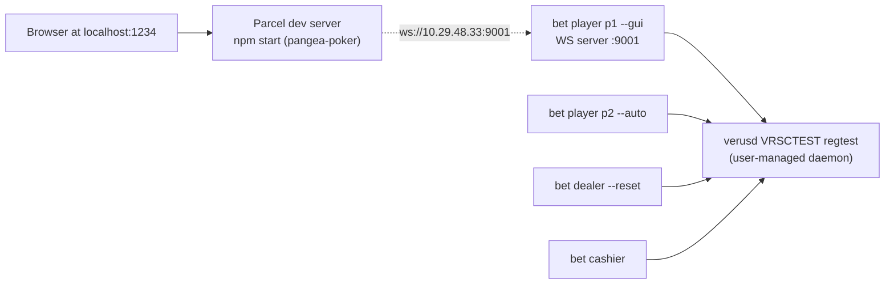

# GUI End-to-End Test Plan (VRSCTEST regtest)

> **Always start at Phase 0.** This file does NOT carry per-phase completion
> status. Per `.cursor/rules/gui_e2e_phase0_testing.mdc`, every E2E run begins
> from Phase 0 in this session and walks forward — saved progress in any
> external todo store is treated as a historical note, not skip-permission.

> **Backend is locked.** The `bet` backend is on `gui_dev` at HEAD `48f42336`
> ("deck: enlarge from 14 to a full 52 cards"). No backend code, configs, or
> Verus identities are to be modified during this test sequence. The only
> changes considered will be in `pangea-poker` (GUI) and only with explicit
> per-fix approval.

---

## Topology



- p1 plays via the GUI; p2 auto-plays.
- p1 joins **first** (GUI flow: empty table → Find Table → pick seat → live updates as p2 arrives).
- Default node host in `CustomIP.tsx` is `10.29.48.33` (this machine's primary
  IP). Backend WS server (`lws`) listens on all interfaces, so loopback through
  the host IP works.

---

## Constants for this host

| Item | Value |
|---|---|
| Chain | `VRSCTEST` regtest, RPC port `18843`, datadir `/root/.komodo/vrsctest/` |
| Wallet | `/root/.komodo/vrsctest/wallet.dat` |
| `bet` repo | `/home/sarat/bet/` |
| `bet` binary | `/home/sarat/bet/poker/bin/bet` |
| `bet` config dir | `/home/sarat/bet/poker/config/` |
| `bet` log dir | `/root/.bet/logs/` |
| `pangea-poker` repo | `/home/sarat/pangea-poker/` |
| GUI dev URL | `http://localhost:1234` (Parcel 1) |
| p1 WS server (LWS) | `:9001` (from `p1.ini`) |
| p2 WS server (LWS) | `:9002` (only used if p2 runs in `--gui`; we run p2 in `--auto`) |
| Cashier GUI WS | `:9002` (only used if cashier ever runs `--gui`; not in this test) |
| Default GUI host (CustomIP.tsx) | `10.29.48.33` |
| Identity namespace | `sg777z.VRSCTEST@` |

### Verus IDs in play

| Name (FQN) | i-address | Role |
|---|---|---|
| `dealer.VRSCTEST@` | `i7yo8ErqbGPfJxa9xxkWLHTULk5Sjq6sMi` | dealer aggregator |
| `d1.VRSCTEST@`     | `iJ3zGH2sDxejSixEKND8TKQ53UmhC4yxoY` | dealer-1 instance |
| `t1.VRSCTEST@`     | `i7fbC9ZC4qyKaCG6D4LBHsh1YZGs6N8DPC` | table-1 (game state lives here) |
| `cashier.VRSCTEST@`| `iJpM1EpZRCzCTqpUoqWy3LjJUeS8eMxtFC` | cashier aggregator + payin custody |
| `p1.VRSCTEST@`     | `i5dNbqvQHQ8Y4kHc8yZZ3ru8Ckh2SPTuqY` | player 1 (GUI-driven in this test) |
| `p2.VRSCTEST@`     | `i6N1Fy7p6vR9Dp4Fok9KAUEPX8Pt7vWemZ` | player 2 (auto in this test) |

### Tmux sessions used (must already exist; never created/killed)

`dealer`, `cashier`, `p1`, `p2`. The `blocknotify` session is unused in this
test (cashier self-discovers via player-ID polling).

---

## Phase 0 — Pre-flight (read-only)

All checks are read-only. No node start, no wallet writes, no on-chain calls
beyond plain getters.

```bash
# 1. Chain alive
verus -chain=VRSCTEST getblockcount               # must return a number > 0

# 2. Wallet balance available for payins (>= ~0.5 + 0.5 + headroom CHIPS-equiv on the test chain)
verus -chain=VRSCTEST getbalance                  # whole wallet
# (Per-ID balances if needed:)
# verus -chain=VRSCTEST getaddressbalance '{"addresses":["i5dNbqvQHQ8Y4kHc8yZZ3ru8Ckh2SPTuqY"]}'  # p1
# verus -chain=VRSCTEST getaddressbalance '{"addresses":["i6N1Fy7p6vR9Dp4Fok9KAUEPX8Pt7vWemZ"]}'  # p2

# 3. node_modules present (so `npm start` won't try to install)
test -d /home/sarat/pangea-poker/node_modules && echo OK || echo MISSING

# 4. Ports 1234 and 9001 must be FREE (9002 only matters if you switch p2 to --gui)
ss -ltn | awk '$4 ~ /:(1234|9001|9002)$/ {print}'

# 5. bet binary newer than HEAD commit
ls -la /home/sarat/bet/poker/bin/bet
( cd /home/sarat/bet && git log -1 --pretty=format:"HEAD %h %ci %s" )

# 6. Tmux sessions all present
tmux ls | awk '{print $1}' | grep -E '^(dealer|cashier|p1|p2):' | sort
```

**Pass criteria**

- `getblockcount` returns a positive integer.
- Wallet balance is non-zero and covers two payins + fees.
- `node_modules/` exists.
- Ports `1234` / `9001` are free (no listener).
- `bet` binary mtime is newer than the HEAD commit timestamp.
- All four tmux sessions (`dealer`, `cashier`, `p1`, `p2`) are listed.

If any check fails, **stop and tell the user** before proceeding. Do not start
the daemon, do not run `npm install`, do not free a port. All of those need
explicit approval.

---

## Phase 1 — Bring up backend (dealer + cashier)

Backend launch must use `tmux send-keys` only — never start nodes directly.

```bash
# Stop any stale bet processes inside the four sessions (idempotent C-c).
tmux send-keys -t p2      C-c
tmux send-keys -t p1      C-c
tmux send-keys -t cashier C-c
tmux send-keys -t dealer  C-c

# Dealer (--reset is intentional and pre-approved per VRSCTEST_LOCAL_SETUP §10).
tmux send-keys -t dealer  "cd /home/sarat/bet/poker && ./bin/bet start dealer --config config/dealer.ini --cli --reset 2>&1 | tee /root/.bet/logs/dealer.log" Enter
sleep 5

# Cashier — no --table_id; cashier self-discovers via P_JOIN_REQUEST_KEY polling.
tmux send-keys -t cashier "cd /home/sarat/bet/poker && ./bin/bet start cashier --config config/cashier.ini --cli 2>&1 | tee /root/.bet/logs/cashier.log" Enter
sleep 4
```

**Pass criteria**

- Dealer log contains `Table reset complete` (or equivalent reset confirmation
  for the current build) and is sitting idle waiting for joins.
- Cashier log shows it has entered the player-ID polling loop
  (`polling player IDs for next join` or equivalent).
- `verus -chain=VRSCTEST getidentitycontent 't1.VRSCTEST@'` shows the freshly
  reset table state (`T_GAME_ID`, `T_TABLE_INFO.<g>`, `T_GAME_INFO.<g>`).

Reference: `dealer_reset_table` in `poker/src/dealer.c`.

---

## Phase 2 — Start the GUI dev server

Run as the user (not via the agent — `npm start` is not pre-approved):

```bash
cd /home/sarat/pangea-poker
npm start
```

`package.json` `start` script: `parcel src/index.html --open --out-dir build`.
Default URL `http://localhost:1234`. `--open` will try to open the system
browser; over SSH the user opens it manually pointed at the dev box.

**Pass criteria:** Parcel reports `Server running at http://localhost:1234`,
no compile errors.

---

## Phase 3 — Start p1 in GUI mode

In the `p1` tmux session:

```bash
tmux send-keys -t p1 "cd /home/sarat/bet/poker && ./bin/bet start player --config config/p1.ini --gui 2>&1 | tee /root/.bet/logs/p1.log" Enter
```

This brings up the LWS server on port 9001 (`bet_player_frontend_loop` in
`poker/src/client.c`) and waits for a GUI to connect.

**Pass criteria**

- Log line `[GUI] Player WebSocket server started successfully on port 9001`
  (or equivalent for the current build).
- `Backend status: NOT READY` → flips to `READY` once wallet/identity checks
  pass.

---

## Phase 4 — GUI handshake (user drives)

In the browser:

1. StartupModal opens. Click the **Private Tables** tab.
2. In the **Player** form, leave host = `10.29.48.33`, port = `9001` (defaults
   in `pangea-poker/src/components/Modal/CustomIP.tsx` lines 40–47). Click
   **Set Nodes**.
3. WebSocket opens. `closeStartupModal` fires automatically on `Connected`
   (`pangea-poker/src/components/Game/WebSocket.ts`).
4. Backend sends
   `{"method":"backend_status","backend_status":1,"message":"Backend ready!"}`
   (`bet_gui_init_message` in `poker/src/client.c`). GUI sets
   `backendStatus = 1`; **Find Table** button appears.
5. User clicks **Find Table** → GUI sends `{"method":"table_info"}`
   (`pangea-poker/src/components/FindTableButton/FindTableButton.tsx`).
6. Backend `bet_player_frontend` `case "table_info"` signals the join thread
   and responds with
   `{method:"table_info", balance, addr, max_players:2, table_id:"t1",
   dealer_id:"d1", table_min_stake, small_blind, big_blind, occupied_seats:[]}`.
7. GUI's `case "table_info"` populates seats and shows the table.

**Pass criteria:** GUI table renders with 2 empty seats, balance + blinds shown.

**Watch list (browser console + GUI):**

- Any `Method::xxx is not handled` warnings → backend gap.
- Any unhandled `default` in `onMessage_player` → GUI gap.
- Any TypeError → stop, capture, report.

---

## Phase 5 — p1 joins via GUI

1. User clicks an empty seat (say seat 0). GUI dispatches `playerJoin` →
   sends `{"method":"join_table","seat":0}`
   (`pangea-poker/src/store/actions.ts`).
2. Backend `case "join_table"` (`poker/src/client.c`) sets
   `gui_join_approved = 1`, sends
   `{"method":"join_ack","status":"approved",...}`. GUI shows the approval.
3. Backend join thread proceeds: stack info, payin tx, write to `cashier` ID,
   wait for confirm. This emits `player_init_state` updates 1..7 via
   `send_init_state_to_gui()` — GUI shows `state_name` text per state.
4. Cashier picks up the payin from the player ID's `P_JOIN_REQUEST_KEY` and
   writes `T_PLAYER_INFO.<g>` on `t1`.
5. Dealer poll spots the join, increments `num_players`. Game state stays
   `G_TABLE_STARTED`.

**Pass criteria:** GUI shows p1 sitting at seat 0 with the configured stack;
`player_init_state` reaches `JOINED` (state 7) without a TypeError.

If GUI crashes here, the most likely culprit is a `seats` reducer mismatch on
Public-Tables vs Private-Tables keys. We're on **Private Tables**, where the
`nodes` key is `player`, so this should align
(`pangea-poker/src/components/Modal/CustomIP.tsx`).

---

## Phase 6 — p2 joins (auto)

In the `p2` tmux session:

```bash
tmux send-keys -t p2 "cd /home/sarat/bet/poker && ./bin/bet start player --config config/p2.ini --auto 2>&1 | tee /root/.bet/logs/p2.log" Enter
```

Cashier picks up p2's payin and writes `T_PLAYER_INFO.<g>` for p2. Dealer
transitions `G_TABLE_STARTED → G_PLAYERS_JOINED → G_DECK_SHUFFLING_P/D/B`.

**Open question to verify in flight:** does p1's backend re-emit a `table_info`
(or `seats`) so the GUI sees seat 1 fill in live? `table_info` is only sent in
response to a GUI request, and the legacy `seats` push is only triggered by
old `join_res` messages. **The GUI may show seat 1 still empty until the next
state push.** Likely visible failure mode; will be captured as a gap if it
shows up. Workaround: user clicks Find Table again to force a refresh.

**Pass criteria:** dealer log advances to `G_PLAYERS_JOINED`, then deck
shuffling stages. p1 backend log shows `Player init state: IN_GAME` (or the
current build's equivalent). GUI may or may not auto-update seat 1 (gap-watch).

---

## Phase 7 — Deck shuffling and dealing

Backend cycles `G_DECK_SHUFFLING_P → _D → _B → G_REVEAL_CARD` per card. p1
backend computes its hole cards and sends `gui_build_deal_holecards`
(`poker/src/gui.c`) →
`{method:"deal", deal:{holecards:[Xx,Yy], balance}}`. GUI's `case "deal"`
calls `dealCards` and renders the 2 SVGs.

Then board cards via `gui_build_deal_board` →
`{method:"deal", deal:{board:[...]}}` after each round.

**Pass criteria:** GUI shows two hole cards in p1's seat as soon as they are
decoded; board cards appear progressively (3 → 4 → 5 across rounds).

**Risks:** card glyph mismatch — backend `RANKS = "23456789TJQKA"` /
`SUITS = "cdhs"` (`poker/src/gui.c`) must align with GUI `card-${card}` sprite
map. With the deck enlarged to 52 cards (HEAD `48f42336`), full rank/suit
diversity now actually exercises every glyph; if a card fails to render,
inspect the resulting class against `svg-sprite.css`.

---

## Phase 8 — Betting (4 rounds: pre-flop, flop, turn, river)

Each round:

- Backend sends to whichever player is on action:
  `{method:"betting", action:"round_betting", playerid, pot, toCall,
   minRaiseTo, possibilities, player_funds}` (`poker/src/gui.c`).
- If `playerid` is the GUI player, GUI shows the controls; user clicks one of
  `call/check/raise/fold/allin`.
- GUI's `Controls.tsx` clones `lastMessage`, sets
  `possibilities: [<chosenAction>]`, sends back via `sendMessage` → backend
  `bet_player_round_betting`.
- p2 (auto mode) auto-checks/calls without UI.
- Other player's action arrives back to GUI as
  `{method:"betting", action:"check"|"call"|"raise"|"fold"|"allin",
   playerid, bet_amount}` → renders chip animation.

**Pass criteria:** 4 rounds complete, pot grows, no stuck states, no missed
prompts.

---

## Phase 9 — Showdown and settlement

Backend computes the winner via 7-card hand evaluation (HEAD `48f42336`,
`dealer_evaluate_showdown` in `poker/src/dealer.c`) and sends
`gui_build_final_info` (`poker/src/gui.c`):

```json
{ "method": "finalInfo",
  "winners": [...],
  "win_amount": ...,
  "showInfo": { "allHoleCardsInfo": [...], "boardCardInfo": [...] } }
```

**Known fragility (Gap 3 from `.cursor/AGENT_CONTEXT.md`):** GUI does
`message.showInfo.boardCardInfo.every(...)` and `winners.length`. Backend
always builds `showInfo` and includes `boardCardInfo` only if `board_cards` is
non-NULL (`poker/src/gui.c`). If backend ever calls with a NULL board, GUI
throws. Catch in flight; no preemptive fix.

After `finalInfo`, dealer fires settlement; cashier dispatches the payout txs
on-chain. GUI does not need to handle the on-chain settlement explicitly.

**Pass criteria:** showdown animation runs to completion, both players see
winner, no console TypeError. Settlement on-chain confirmed by checking
`G_SETTLEMENT_COMPLETE` in dealer log and `settle_amounts` reflecting the
correct hand-evaluation outcome (ties split the pot evenly per
`det_dcv_pot_split`).

---

## Phase 10 — Debrief

After the hand finishes (or breaks), capture:

- Browser console errors / warnings (Chrome DevTools → Console).
- Backend tmux logs from each of the 4 sessions (last 200 lines each):
  - `tail -n 200 /root/.bet/logs/dealer.log`
  - `tail -n 200 /root/.bet/logs/cashier.log`
  - `tail -n 200 /root/.bet/logs/p1.log`
  - `tail -n 200 /root/.bet/logs/p2.log`
- Any `Method::xxx is not handled` from backend.
- Any `Method "xxx" not handled` warnings from `default` branch in
  `onMessage_player`.

Compile a list of confirmed gaps. Each gap gets:

- Repro steps
- Suspected file:line on each side (backend `poker/src/...`, GUI `pangea-poker/src/...`)
- Proposed fix (1–2 sentences)
- Severity

Then ask the user which to fix and in what order. **No fixes get applied
without explicit per-gap approval**, and any backend fix would violate the
"backend locked" condition unless the user explicitly unlocks it.

---

## Operating notes

- The agent does not start any node, run any RPC, or commit any patch without
  explicit approval each time.
- The user operates the GUI. If a click is unclear or seat geometry needs
  interpretation, the agent can switch to using the `cursor-ide-browser` MCP
  for snapshots/clicks — but only if the user prefers.
- For each tmux interaction (Ctrl-C, send command), the agent will state
  exactly what is about to happen and wait for go-ahead the first time per
  phase, then proceed for repeat steps in the same phase.
- All GUI patches live on the `pangea-poker` repo. Backend is locked on `bet`'s
  `gui_dev` at HEAD `48f42336` — no backend edits during this test cycle.
- Every commit (GUI or, if unlocked, backend) must follow
  `.cursor/rules/git_author_attribution.mdc`:
  `--author="sg777 <8114482+sg777@users.noreply.github.com>"` plus the
  matching `GIT_COMMITTER_*` env vars.
- The agent will not touch `verusd`, the wallet, or any Verus ID outside the
  dealer/cashier/p1/p2 already-active flow.
